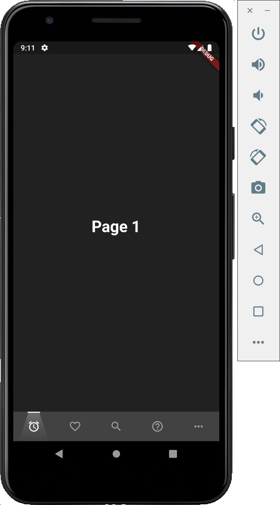
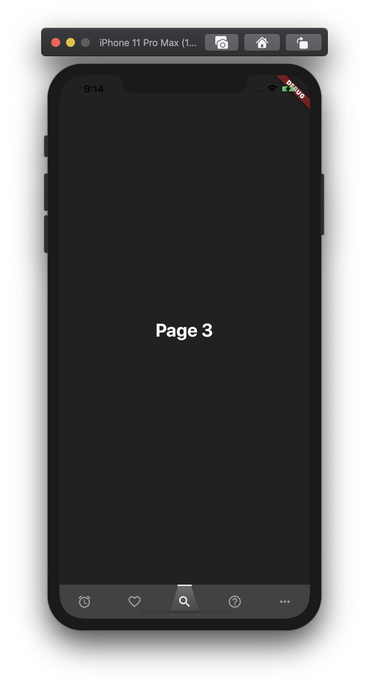

# Lamp Bottom Navigation

<p align="left">
 <a href="https://pub.dev/packages/lamp_bottom_navigation">
    
  </a>
</p>

A Flutter package for easy implementation of lamp bottom navigation 🔥.

## Example App
     

## Add dependency

```yaml
dependencies:
  ...
  lamp_bottom_navigation: ^0.0.1
```

## Basic Usage

Adding the widget
```dart
import 'package:flutter/material.dart';

import 'package:lamp_bottom_navigation/lamp_bottom_navigation.dart';

void main() => runApp(MyApp());

class MyApp extends StatelessWidget {
  @override
  Widget build(BuildContext context) {
    return MaterialApp(
      home: HomePage(),
    );
  }
}

class HomePage extends StatefulWidget {
  @override
  _HomePageState createState() => _HomePageState();
}

class _HomePageState extends State<HomePage> {
  PageController _pageController;
  int _page = 0;

  void _navigationTapped(int page) {
    _pageController.jumpToPage(page);
  }

  @override
  void initState() {
    super.initState();
    _pageController = PageController(initialPage: 0);
  }

  @override
  void dispose() {
    super.dispose();
    _pageController.dispose();
  }

  void _onPageChanged(int page) {
    setState(() {
      this._page = page;
    });
  }

  @override
  Widget build(BuildContext context) {
    return Scaffold(
      backgroundColor: Colors.grey[900],
      body: PageView(
        physics: NeverScrollableScrollPhysics(),
        controller: _pageController,
        onPageChanged: _onPageChanged,
        children: <Widget>[
          Center(
            child: Text(
              "Page 1",
              style: TextStyle(
                  color: Colors.white,
                  fontWeight: FontWeight.bold,
                  fontSize: 30),
            ),
          ),
          Center(
            child: Text(
              "Page 2",
              style: TextStyle(
                  color: Colors.white,
                  fontWeight: FontWeight.bold,
                  fontSize: 30),
            ),
          ),
          Center(
            child: Text(
              "Page 3",
              style: TextStyle(
                  color: Colors.white,
                  fontWeight: FontWeight.bold,
                  fontSize: 30),
            ),
          ),
          Center(
            child: Text(
              "Page 4",
              style: TextStyle(
                  color: Colors.white,
                  fontWeight: FontWeight.bold,
                  fontSize: 30),
            ),
          ),
          Center(
            child: Text(
              "Page 5",
              style: TextStyle(
                  color: Colors.white,
                  fontWeight: FontWeight.bold,
                  fontSize: 30),
            ),
          ),
        ],
      ),
      bottomNavigationBar: ShadowBottomNavigationBar(
        items: <IconData>[
          Icons.access_alarm,
          Icons.favorite_border,
          Icons.search,
          Icons.help_outline,
          Icons.more_horiz,
        ],
        width: double.infinity,
        onTap: _navigationTapped,
        currentIndex: _page,
      ),
    );
  }
}
```

## Contributing

Contributions are welcome, please submit a PR :)

## Inspiration

I found this widget from someone (I forgot the person) who shared it on LinkedIn, but he just made a normal widget (not the Bottom Navigation Bar) and I modified it from the widget to become the Bottom Navigation Bar.

## LICENSE

[MIT License](https://github.com/rrifafauzikomara/lamp_bottom_navigation/blob/master/LICENSE)

## Author

* **R Rifa Fauzi Komara**

Don't forget to follow, fork and give me a ★